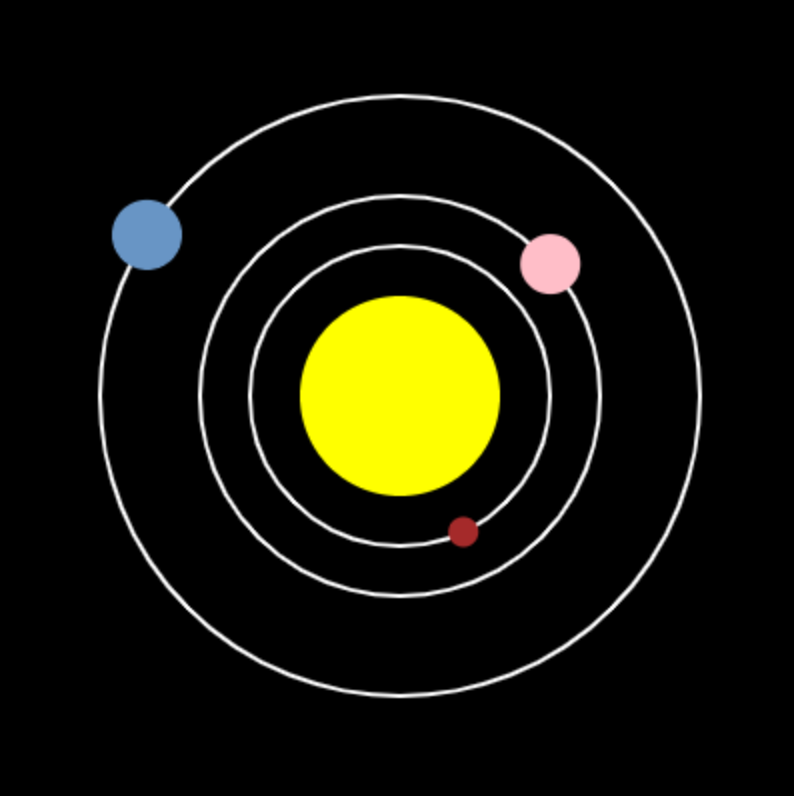

  <a class="c-survey-banner__link" href="https://form.raspberrypi.org/f/code-editor-feedback" target="_blank">Take our survey</a> to help make our Code Editor better!

## You will make

Get to know Python dictionaries by creating a model of the solar system.

--- no-print ---

--- task ---
### Play ▶️

  
Run the program to create the model. Try clicking on each planet to see facts about them.

<iframe src="https://editor.raspberrypi.org/en/embed/viewer/solar-system-example" width="600" height="600" frameborder="0" marginwidth="0" marginheight="0" allowfullscreen>
</iframe>

--- /task ---

--- /no-print ---

--- print-only ---

--- /print-only ---

**The limits of models:** Even very advanced models leave out details to make them easier to build and run. In fact, it's not possible to make an accurate model of the whole solar system as all the planets pull on each other because of gravity. The maths to predict exactly where they will go has not been invented yet as a result.

 This model uses the order of the planets, and their speeds and sizes. But, for example, Mercury needs to be slow enough so you can click on it. So the model makes Mercury faster than the other planets, but not as fast as it really is.

You will:
 - Use **dictionaries** to store and look up data
 - Load data from a file into **dictionaries**
 - Create an animated, interactive, solar system model using the `p5` library

**Dictionaries:** When you make a Python dictionary, it stores things you can look up later. This is a lot like a normal dictionary. But the Python version can store much more than the meanings of words!

