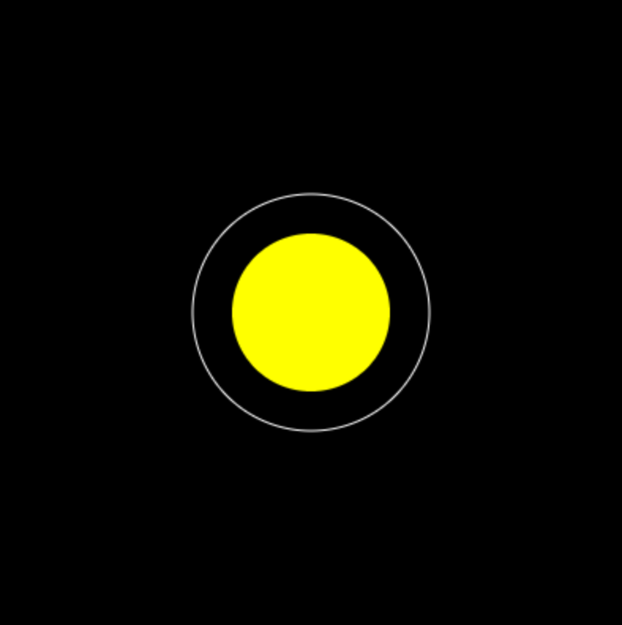

## Create a dictionary

<div style="display: flex; flex-wrap: wrap">
<div style="flex-basis: 200px; flex-grow: 1; margin-right: 15px;">
To start, you'll collect some information about Mercury and draw its orbit.
</div>
<div>
{:width="300px"}
</div>
</div>

--- task ---

Open the [Solar system starter project](https://editor.raspberrypi.org/en/projects/solar-system-starter){:target="_blank"}. The Raspberry Pi code editor will open in another browser tab.

If you have a Raspberry Pi account, you can click on the **Save button** to save a copy to your `Projects` library.

--- /task ---

### Make a dictionary

Python dictionaries let you look up a **key** and get its **value**. That could be a word and its meaning, which are both text. But you could also use a text key (like `'distance'`) to get a value that's a number, or anything else you can store in Python.

--- collapse ---
---
title: Python dictionaries
---

A dictionary in Python stores pairs of **keys** and **values**.

Keys and values can be almost any value you can store in Python. Although lists and dictionaries cannot be keys.

You can use a key to get its associated value.

To make a dictionary, you use curly brackets `{}`, with `key: value` pairs inside. A pair is a key, followed by a colon (`:`), followed by the value connected to that key. For example:

```python
person = {
    'age': 12,
    'height': 149.5,
    'hair': 'brown',
}
```
Here, `age`, `height`, and `hair` are keys. You can use them to look up their values with square brackets `[]`. For example:

```python
print(person['hair'])
```
This will print out the value `brown`.
--- /collapse ---

--- task ---

Find the `# load_planets function` comment in the starter project. Create the function below the comment. Inside the function, make a global `mercury` dictionary. Then, add information about Mercury to the dictionary.

<table>
<thead>
  <tr>
    <th>Key</th>
    <th>Value</th>
  </tr>
</thead>
<tbody>
  <tr>
    <td>name</td>
    <td>Mercury</td>
  </tr>
  <tr>
    <td>colour</td>
    <td>Color(165, 42, 42)</td>
  </tr>
  <tr>
    <td>size</td>
    <td>15</td>
  </tr>
  <tr>
    <td>orbit</td>
    <td>150</td>
  </tr>
  <tr>
    <td>speed</td>
    <td>1</td>
  </tr>
  <tr>
    <td>info</td>
    <td>The smallest and fastest planet.</td>
  </tr>
</tbody>
</table>

Curly brackets `{}` are used to start and end the dictionary. A colon `:` is used to separate the key and the value(s). A comma `,` is used to separate each dictionary item. 

--- code ---
---
language: python
filename: main.py — load_planets()
line_numbers: true
line_number_start: 16
line_highlights: 17-27
---
# load_planets function
def load_planets():
    global mercury

    mercury = {
        'name': 'Mercury',
        'colour': Color(165, 42, 42),
        'size': 15,
        'orbit': 150,
        'speed': 1,
        'info': 'The smallest and fastest planet.'
    }
--- /code ---

**Tip:** You can put each `key: value` pair on its own line. This makes the code easier to read, but be sure to keep it all inside the curly brackets `{}`.

--- /task ---

Using a dictionary lets you keep all the information about Mercury in one place. This makes it easier to find it, and change it if you need to.

--- task ---

Call `load_planets()` in your `setup()` function.

--- code ---
---
language: python
filename: main.py — setup()
line_numbers: true
line_number_start: 30
line_highlights: 33
---
def setup():
    # Put code to run once here
    size(400, 400)
    load_planets()
  
--- /code ---

--- /task ---

### Draw Mercury's orbit

<p style="border-left: solid; border-width:10px; border-color: #0faeb0; background-color: aliceblue; padding: 10px;">
<span style="color: #0faeb0">**Modelling orbits:**</span> The real planets' orbits are not perfect circles — they're the shape of an ellipse. But using circles makes the model easier to build!
</p>

You can get a value from a dictionary by putting its key in square brackets `[]`, just like getting a list item by its index. For example, `mercury['size']` would get you the matching value `15`.

--- task ---

Find the `#draw_orbits function` comment. Create the `draw_orbits()` function below it. Then draw Mercury's orbit as an `ellipse` centered in the middle  of the model `width/2` and `height/2`. The size of the `ellipse` will be `mercury['orbit']`, which is stored in your dictionary as `150`.

[[[processing-python-ellipse]]]

--- code ---
---
language: python
filename: main.py — draw_orbits()
line_numbers: true
line_number_start: 10
line_highlights: 11-15
---
# draw_orbits function
def draw_orbits():
    no_fill()
    stroke(255)  # Make it white

    ellipse(width / 2, height / 2, mercury['orbit'], mercury['orbit'])
  
--- /code ---

--- /task ---

--- task ---

Call your `draw_orbits()` function from your `draw()` function.

--- code ---
---
language: python
filename: main.py — draw()
line_numbers: true
line_number_start: 39
line_highlights: 42 
---
def draw():
    # Put code to run every frame here
    background(0)
    no_stroke()
    draw_sun()
    draw_orbits()
  
--- /code ---

--- /task ---

--- task ---

 **Test:** Run your code and see the orbit of Mercury appear.


**Debug:** If you see a message about `mercury` being 'not defined':
 - Check your `load_planets()` function to be sure that it declares `mercury` as `global`
 - Check that `load_planets()` is called in `setup()`

**Debug:** If the orbit doesn't appear:
 - Check that you have called `draw_orbits()` in your `draw()` function
 - Check `draw_orbits()` to be sure you have used `stroke(255)` to make the ellipse white

**Debug:** If the orbit is a filled circle, instead of a ring, check you have `no_fill()` in your `draw_orbits()` function.

**Debug:** If you get a `bad input` error, check that you have a `:` in between the keys and values of your `mercury` dictionary, and that each line (except the very last one) has a comma.

--- /task ---

--- save ---

