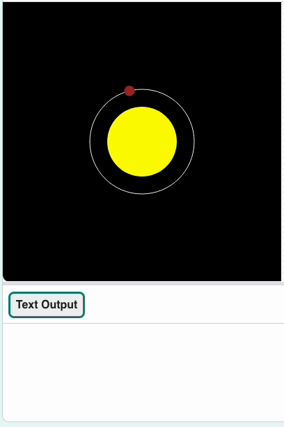

## Make Mercury

Now you'll put Mercury in orbit of the sun.

{:width="300px"}

### Draw Mercury

The `make_planet()` function is written in a separate file that is included as part of the starter project and imported into `main.py` for you to use.

`make_planet()` uses the colour, orbit, size, and speed of a planet to draw the planet orbiting the sun.

--- task ---

Find the `# draw_planets function` comment. Create the function below it. 

Make variables to store the values needed to draw Mercury. Then call `make_planet()`, passing it those values.

[[[parameters]]]

--- code ---
---
language: python
filename: main.py — draw_planets()
line_numbers: true
line_number_start: 17
line_highlights: 18-29
---
# draw_planets function
def draw_planets():
    colour = mercury['colour']
    orbit = mercury['orbit']
    size = mercury['size']
    speed = mercury['speed']

    make_planet(
        colour, 
        orbit, 
        size, 
        speed
    )
--- /code ---

**Tip:** You created your dictionary with one line for each `key: value` pair. You can do the same when passing values to a function to make your code easier to read.

--- /task ---

--- task ---

Add a call to `draw_planets()` in the `draw()` function.

--- code ---
---
language: python
filename: main.py — draw()
line_numbers: true
line_number_start: 50
line_highlights: 56
---
def draw():
    # Put code to run every frame here
    background(0)
    no_stroke()
    draw_sun()
    draw_orbits()
    draw_planets()
--- /code ---

--- /task ---

--- task ---

**Test:** Run your code and see Mercury in orbit!

{:width="400px"}

**Debug:** If you get a message about 'KeyError', check the spelling of your keys in `make_planet()`. Make sure the spelling is the same in `load_planets()`. Whether the letters are UPPER CASE or lower case is important too.

**Debug:** If Mercury doesn't appear:
 - Check that you are calling `draw_planets()` in `draw()` 
 - Make sure that that call is after `background(0)`

**Debug:** If Mercury is too big, too slow, or not visible, check that your `draw_planets()` code is the same as the example. In particular, check that the keys are in the right order.

--- /task ---

### Tell users about the planet

Users will click on Mercury and your program will print the information in `mercury['info']`.

The `mouse_pressed()` function was included as part of the starter project. It contains code to get the hex value of a colour a user clicked on. You can use this to tell which planet they have clicked.

--- task ---

Find `mouse_pressed()` and add an `if` statement. Have it `print` Mercury's name and information when the user clicks on the planet.

--- code ---
---
language: python
filename: main.py — mouse_pressed()
line_numbers: true
line_number_start: 60
line_highlights: 64-66
---
def mouse_pressed():
    # Put code to run when the mouse is pressed here
    pixel_colour = Color(get(mouse_x, mouse_y)).hex  # Here the RGB value is converted to Hex so it can be used in a string comparison later

    if pixel_colour == mercury['colour'].hex:
        print(mercury['name'])
        print(mercury['info'])

--- /code ---

--- /task ---

When the user clicks on a pixel, the hex colour value of the pixel is retrieved and compared against the colours of the planets. If the pixel colour is the same as a planet's colour, information about that planet is displayed.

--- task ---

**Test:** Run your code and click on Mercury to see its information print out. If it's moving too fast, change the `frame_rate` value in the `run()` function to slow the whole model down.

{:width="400px"}

**Debug:** If nothing happens when you click on Mercury, check your `if` statement. Make sure it looks exactly like the example above. Check that you have `==` and not `=`.

**Debug:** If you get a message about 'KeyError', check the spelling of your keys (`'name'` and `'info'`) in `mouse_pressed()`. Make sure the spelling is the same in `load_planets()`.

--- /task ---

--- save ---
