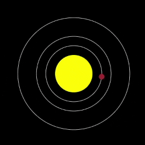

## Load more planets

<div style="display: flex; flex-wrap: wrap">
<div style="flex-basis: 200px; flex-grow: 1; margin-right: 15px;">
Add Venus and Earth to join Mercury in your model.
</div>
<div>

</div>
</div>

Values for other planets are in the `planets.csv` file.

--- collapse ---
---
title: What's in planets.csv?
---

`planets.csv` has a line of headings, followed by one line for each planet in the Solar System. The colour of a planet is made of three values — one each for red, green, and blue. For example:

```
planet,colour_r,colour_g,colour_b,size,orbit,speed,info
Mercury,165,42,42,15,150,1,The smallest and fastest planet.
Venus,255,190,200,30,200,0.75,The hottest planet in the Solar System. Water would turn to steam and some metals would melt just by being there!
Earth,104,149,197,35,300,0.5,You are here — the only planet we know of that can support life.
```

--- /collapse ---

--- task ---

Add `global` variables for Venus and Earth to your `load_planets()` function:

--- code ---
---
language: python
filename: main.py — load_planets()
line_numbers: true
line_number_start: 42
line_highlights: 44
---
# load_planets function
def load_planets():
  global mercury, venus, earth
--- /code ---

--- /task ---

--- task ---

Below your `mercury` dictionary, load `planets.csv` to a `data` variable. Then use the `splitlines()` function to split the text string in `data` into a list. Each line in the string will become an item in the list.

[[[generic-python-file-read]]]

--- code ---
---
language: python
filename: main.py — load_planets()
line_numbers: true
line_number_start: 46
line_highlights: 55-57
---
  mercury = {
      'name': 'Mercury',
      'colour': color(165, 42, 42),
      'size': 15,
      'orbit': 150,
      'speed': 1,
      'info': 'The smallest, and fastest, planet.'
  }
  
  with open('planets.csv') as f:
    data = f.read()
    lines = data.splitlines()
--- /code ---

--- /task ---

Now you have the data in your program. Next, you'll make that data into dictionaries, like the one you made for Mercury. `lines[2]` has the data for Venus, and `lines[3]` has the dat for Earth.

--- task ---

Split `lines[2]` at the commas and store it in `planet`. Load the list of values from `planet` into a `venus` dictionary. As you are making the dictionary, change any numbers from text to Python numbers using `int()` and `float()`.

--- code ---
---
language: python
filename: main.py — load_planets()
line_numbers: true
line_number_start: 55
line_highlights: 59-67
---
  with open('planets.csv') as f:
    data = f.read()
    lines = data.splitlines()

  planet = lines[2].split(',') # Split Venus' data
  venus = { 
    'name': planet[0],
    'colour': color(int(planet[1]), int(planet[2]), int(planet[3])),
    'size': int(planet[4]), # int() for whole numbers
    'orbit': int(planet[5]),
    'speed': float(planet[6]), # float() for decimals
    'info': planet[7]
  }
--- /code ---

--- /task ---

Next you'll the add `earth` data in the same way. The code to do this is almost the same as the code for `venus`. You can save time by copying and pasting the code instead of typing it again.

--- task ---

Copy the `venus` code and paste it below the original. Change `lines[2]` to `lines[3]`, and `venus` to `earth`. Check that the indentation of the first line is still correct.

--- collapse ---
---
title: Copying and pasting
---

You can copy text and paste a copy in another place.

 1. Select the text you want to copy by dragging your mouse over it while holding down the left button.
 2. Copy the text by using your browser's menu — choose `Edit > Copy`. You can also use a keyboard shortcut — `Ctrl + C` on Windows or Linux, or `Cmd + C` on a Mac.
 3. Move your text cursor (the flashing line that shows where you are typing) to where you want to place a copy of the text.
 4. Paste the text by using your browser's menu — choose `Edit > Paste`. You can also use a keyboard shortcut — `Ctrl + V` on Windows or Linux, or `Cmd + V` on a Mac.

--- /collapse ---

{:width="300px"}

--- code ---
---
language: python
filename: main.py — load_planets()
line_numbers: true
line_number_start: 55
line_highlights: 69-77
---
  with open('planets.csv') as f:
    data = f.read()
    lines = data.splitlines()

  planet = lines[2].split(',')
  venus = { 
    'name': planet[0],
    'colour': color(int(planet[1]), int(planet[2]), int(planet[3])),
    'size': int(planet[4]), 
    'orbit': int(planet[5]),
    'speed': float(planet[6]), 
    'info': planet[7]
  }

  planet = lines[3].split(',') 
  earth = { 
    'name': planet[0],
    'colour': color(int(planet[1]), int(planet[2]), int(planet[3])),
    'size': int(planet[4]), 
    'orbit': int(planet[5]),
    'speed': float(planet[6]), 
    'info': planet[7]
  }

--- /code ---

--- /task ---

--- task ---

Go to your `draw_orbits()` function and add the orbits of Venus and Earth.

--- code ---
---
language: python
filename: main.py — draw_orbits()
line_numbers: true
line_number_start: 24
line_highlights: 30-31
---
# draw_orbits function
def draw_orbits():
  no_fill()
  stroke(255) # Make it white
  
  ellipse(width / 2, height / 2, mercury['orbit'], mercury['orbit'])
  ellipse(width / 2, height / 2, venus['orbit'], venus['orbit'])
  ellipse(width / 2, height / 2, earth['orbit'], earth['orbit'])

--- /code ---

--- /task ---

--- task ---

 **Test:** Run your code and see the orbits of Venus and Earth appear.


**Debug:** if you see a message about `venus` or `earth` being 'not defined', check `load_planets()`. Make sure you have declared `venus` and `earth`  as `global`.

--- /task ---

--- save ---
