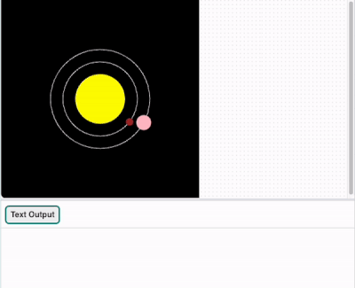
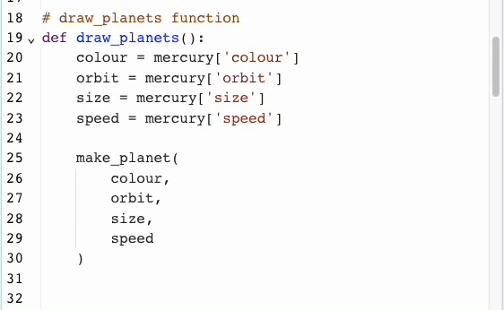

## Make Venus

<div style="display: flex; flex-wrap: wrap">
<div style="flex-basis: 200px; flex-grow: 1; margin-right: 15px;">
It's time for Venus to join Mercury in your model.
</div>
<div>

</div>
</div>

Values for other planets are in the `planets.csv` file.

--- collapse ---
---
title: What's in planets.csv?
---

The file `planets.csv` has a line of headings, followed by one line for each planet in the solar system. The colour of a planet is made up of three values — one each for red, green, and blue. For example:

```
planet,colour_r,colour_g,colour_b,size,orbit,speed,info
Mercury,165,42,42,15,150,1,The smallest and fastest planet.
Venus,255,190,200,30,200,0.75,The hottest planet in the solar system. Water would turn to steam and some metals would melt just by being there!
Earth,104,149,197,35,300,0.5,You are here — the only planet we know of that can support life.
```

--- /collapse ---

### Load the data

--- task ---

Add a `global` variable for Venus to your `load_planets()` function:

--- code ---
---
language: python
filename: main.py — load_planets()
line_numbers: true
line_number_start: 32
line_highlights: 33
---
# load_planets function
def load_planets():
    global mercury, venus
--- /code ---

--- /task ---

--- task ---

Below your `mercury` dictionary, load `planets.csv` to a `data` variable. Then use the `splitlines()` function to split the text string in `data` into a list. Each line in the string will become an item in the list.

[[[generic-python-file-read]]]

--- code ---
---
language: python
filename: main.py — load_planets()
line_numbers: true
line_number_start: 35
line_highlights: 44-46
---
    mercury = {
        'name': 'Mercury',
        'colour': Color(165, 42, 42),
        'size': 15,
        'orbit': 150,
        'speed': 1,
        'info': 'The smallest and fastest planet.'
    }
    
    with open('planets.csv') as f:
        data = f.read()
        lines = data.splitlines()
--- /code ---

--- /task ---

Now you have the data in your program. Next, you'll make that data into dictionaries, like the one you made for Mercury. `lines[2]` has the data for Venus, and `lines[3]` has the data for Earth.

--- task ---

Split `lines[2]` at the commas and store it in `planet`. Then print `planet` out.

--- code ---
---
language: python
filename: main.py — load_planets()
line_numbers: true
line_number_start: 44
line_highlights: 48-49
---
    with open('planets.csv') as f:
        data = f.read()
        lines = data.splitlines()

    planet = lines[2].split(',')  # Split Venus' data
    print(planet)
--- /code ---

--- /task ---

--- task ---

**Test:** Try running your code, and look at the list of data it prints out. Notice that the numbers are inside  quotes `'`. This shows that Python sees them as text strings, instead of numbers it could do maths with.


**Debug:** If your `planet` prints out a list with only one item, then check that you have `','` in the `()` of `lines[2].split()`.

**Debug:** If you see a message about `split` being 'not defined', check that you have included `lines[2].` before it.

**Debug:** If you see a message like `'list' object has no attribute 'split'`, check that you have included `[2]` after `lines`.

**Tip:** Now that you've used it for testing, you can comment-out `print(planet)` with `#`.

--- /task ---

--- task ---

Load the list of values from `planet` into a `venus` dictionary. As you are making the dictionary, change any numbers from text to numbers. Use `int()` for whole numbers and `float()` for decimals.

--- code ---
---
language: python
filename: main.py — load_planets()
line_numbers: true
line_number_start: 44
line_highlights: 50-57
---
    with open('planets.csv') as f:
        data = f.read()
        lines = data.splitlines()

    planet = lines[2].split(',')  # Split Venus' data
    #print(planet)
    venus = { 
        'name': planet[0],
        'colour': Color(int(planet[1]), int(planet[2]), int(planet[3])),  # Make them numbers
        'size': int(planet[4]),  # int() for whole numbers
        'orbit': int(planet[5]),
        'speed': float(planet[6]),  # float() for decimals
        'info': planet[7]
    }
--- /code ---

--- /task ---

--- task ---

### Draw the orbit

Go to your `draw_orbits()` function and add the orbit of Venus.

--- code ---
---
language: python
filename: main.py — draw_orbits()
line_numbers: true
line_number_start: 10
line_highlights: 16
---
# draw_orbits function
def draw_orbits():
    no_fill()
    stroke(255) # Make it white

    ellipse(width / 2, height / 2, mercury['orbit'], mercury['orbit'])
    ellipse(width / 2, height / 2, venus['orbit'], venus['orbit'])

--- /code ---

--- /task ---

--- task ---

**Test:** Run your code and see the orbit of Venus appear.


**Debug:** If you see a message about `venus` being 'not defined', check `load_planets()`. Make sure you have declared `venus`  as `global`.

--- /task ---

### Draw the planet

--- task ---

Go to your `draw_planets()` function. Add a `make_planet()` call, passing it the values for Venus.

**Tip:** You can copy and paste the code you used to make Mercury to save some time and typing. Just change all the mentions of `mercury` to `venus` in the copy.

--- collapse ---
---
title: Copy and pasting
---

You can copy text and paste a copy in another place.

 1. Select the text you want to copy by dragging your mouse over it while holding down the left button.
 2. Copy the text by using your browser's menu — choose **Edit** > **Copy**. You can also use a keyboard shortcut — <kbd>Ctrl</kbd>+<kbd>C</kbd> on Windows or Linux, or <kbd>Cmd</kbd>+<kbd>C</kbd> on a Mac.
 3. Move your text cursor (the flashing line that shows where you are typing) to where you want to place a copy of the text.
 4. Paste the text by using your browser's menu — choose **Edit** > **Paste**. You can also use a keyboard shortcut — <kbd>Ctrl</kbd>+<kbd>V</kbd> on Windows or Linux, or <kbd>Cmd</kbd>+<kbd>V</kbd> on a Mac.

Then you can make any changes you need to the copy.

{:width="300px"}

--- /collapse ---

--- code ---
---
language: python
filename: main.py — draw_planets()
line_numbers: true
line_number_start: 18
line_highlights: 31-41
---
# draw_planets function
def draw_planets():
    colour = mercury['colour']
    orbit = mercury['orbit']
    size = mercury['size']
    speed = mercury['speed']

    make_planet(
        colour, 
        orbit, 
        size, 
        speed
    )

    colour = venus['colour']
    orbit = venus['orbit']
    size = venus['size']
    speed = venus['speed']

    make_planet(
        colour, 
        orbit, 
        size, 
        speed
    )
--- /code ---

--- /task ---

--- task ---

**Test:** Run your code and check that Venus orbits the Sun.

{:width="400px"}

**Debug:** If you get a message about 'KeyError', check the spelling of your keys in `make_planet()`. Make sure the spelling is the same in `load_planets()`. Whether the letters are UPPER CASE or lower case is important too.

**Debug:** If any planet is too big, too slow, or not visible, check that your `draw_planets()` code is the same as the example. In particular, check that the keys are in the right order.

--- /task ---

### Tell users about Venus

Like Mercury, Venus should print out an interesting fact when it's clicked on.

--- task ---

In `mouse_pressed()` add `elif` statements after the `if` statement you made for Mercury. Have these check for Venus' colour. Then, if there's a match, `print()` the right fact.

--- code ---
---
language: python
filename: main.py — mouse_pressed()
line_numbers: true
line_number_start: 83
line_highlights: 87-92
---
def mouse_pressed():
    # Put code to run when the mouse is pressed here
    pixel_colour = Color(get(mouse_x, mouse_y)).hex  # Here the RGB value is converted to Hex so it can be used in a string comparison later

    if pixel_colour == mercury['colour'].hex:
        print(mercury['name'])
        print(mercury['info'])
    elif pixel_colour == venus['colour'].hex:
        print(venus['name'])
        print(venus['info'])

--- /code ---

--- /task ---

--- task ---

**Test:** Run your code. Click on Venus to see its information print out.

{:width="400px"}

**Debug:** If nothing happens when you click on Venus, check its `elif` statement. Make sure it looks exactly like the example above. Check that you have `==` and not `=`.

--- /task ---

--- save ---
