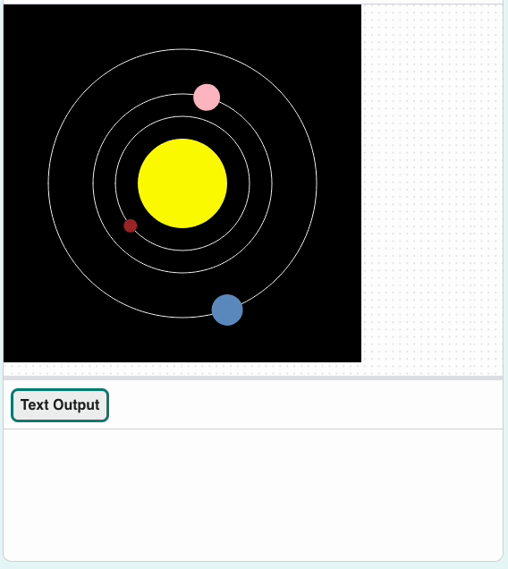

## Make Earth

Now finish the model by adding the planet you're on!

{:width="400px"}

### Load the data

--- task ---

Add a `global` variable for Earth to your `load_planets()` function:

--- code ---
---
language: python
filename: main.py — load_planets()
line_numbers: true
line_number_start: 47
line_highlights: 49
---
# load_planets function
def load_planets():
    global mercury, venus, earth
--- /code ---

--- /task ---

You already have the data in your program: Earth's data was loaded into `lines` when you loaded `planets.csv`.

--- task ---

Below your `venus` dictionary, split `lines[3]` and put it in an `earth` dictionary.

**Tip:** You can copy and paste the code you used to make the `venus` dictionary to save you some time. Then just make small changes — `lines[2]` to `lines[3]`, and `venus` to `earth`.

--- code ---
---
language: python
filename: main.py — load_planets()
line_numbers: true
line_number_start: 56
line_highlights: 71-79
---
    with open('planets.csv') as f:
        data = f.read()
        lines = data.splitlines()

    planet = lines[2].split(',')
    #print(planet)
    venus = { 
        'name': planet[0],
        'colour': Color(int(planet[1]), int(planet[2]), int(planet[3])),
        'size': int(planet[4]), 
        'orbit': int(planet[5]),
        'speed': float(planet[6]), 
        'info': planet[7]
    }

    planet = lines[3].split(',') 
    earth = { 
        'name': planet[0],
        'colour': Color(int(planet[1]), int(planet[2]), int(planet[3])),
        'size': int(planet[4]), 
        'orbit': int(planet[5]),
        'speed': float(planet[6]), 
        'info': planet[7]
    }

--- /code ---

--- /task ---

### Draw the orbit

--- task ---

Go to your `draw_orbits()` function and add the orbit of Earth.

--- code ---
---
language: python
filename: main.py — draw_orbits()
line_numbers: true
line_number_start: 10
line_highlights: 17
---
# draw_orbits function
def draw_orbits():
    no_fill()
    stroke(255)  # Make it white

    ellipse(width / 2, height / 2, mercury['orbit'], mercury['orbit'])
    ellipse(width / 2, height / 2, venus['orbit'], venus['orbit'])
    ellipse(width / 2, height / 2, earth['orbit'], earth['orbit'])

--- /code ---

--- /task ---

--- task ---

 **Test:** Run your code and see the orbit of Earth appear.

**Debug:** If you see a message about `earth` being 'not defined', check `load_planets()`. Make sure you have declared `earth`  as `global`.

--- /task ---

### Draw Earth

--- task ---

Go to your `draw_planets()` function. Add a `make_planet()` call, passing it the values for Earth. Like with Venus, you can copy and paste code here to save yourself some work.

--- code ---
---
language: python
filename: main.py — draw_planets()
line_numbers: true
line_number_start: 19
line_highlights: 45-55
---
# draw_planets function
def draw_planets():
    colour = mercury['colour']
    orbit = mercury['orbit']
    size = mercury['size']
    speed = mercury['speed']

    make_planet(
        colour, 
        orbit, 
        size, 
        speed
    )

    colour = venus['colour']
    orbit = venus['orbit']
    size = venus['size']
    speed = venus['speed']

    make_planet(
        colour, 
        orbit, 
        size, 
        speed
    )

    colour = earth['colour']
    orbit = earth['orbit']
    size = earth['size']
    speed = earth['speed']

    make_planet(
        colour, 
        orbit, 
        size, 
        speed
    )

--- /code ---

--- /task ---

--- task ---

**Test:** Run your code and check that Earth orbits the Sun.

{:width="400px"}

**Debug:** If you get a message about 'KeyError', check the spelling of your keys in `make_planet()`. Make sure the spelling is the same in `load_planets()`. Whether the letters are UPPER CASE or lower case is important too.

**Debug:** If any planet is too big, too slow, or not visible, check that your `draw_planets()` code is the same as the example. In particular, check that the keys are in the right order.

--- /task ---

### Tell users about Earth

Like Mercury and Venus, Earth should print out an interesting fact when it's clicked on.

--- task ---

In `mouse_pressed()` add an `elif` statement for Earth like the one you made for Venus. Have it check for Earth's colour. Then, if there's a match, `print()` the right fact.

--- code ---
---
language: python
filename: main.py — mouse_pressed()
line_numbers: true
line_number_start: 108
line_highlights: 118-120
---
def mouse_pressed():
    # Put code to run when the mouse is pressed here
    pixel_colour = Color(get(mouse_x, mouse_y)).hex  # Here the RGB value is converted to Hex so it can be used in a string comparison later

    if pixel_colour == mercury['colour'].hex:
        print(mercury['name'])
        print(mercury['info'])
    elif pixel_colour == venus['colour'].hex:
        print(venus['name'])
        print(venus['info'])
    elif pixel_colour == earth['colour'].hex:
        print(earth['name'])
        print(earth['info'])

--- /code ---

--- /task ---

--- task ---

**Test:** Run your code. Click on Earth to see its information print out.

{:width="400px"}

**Debug:** If nothing happens when you click on Earth, check its `elif` statement. Make sure it looks exactly like the example above. Check that you have `==` and not `=`.

--- /task ---

--- save ---
