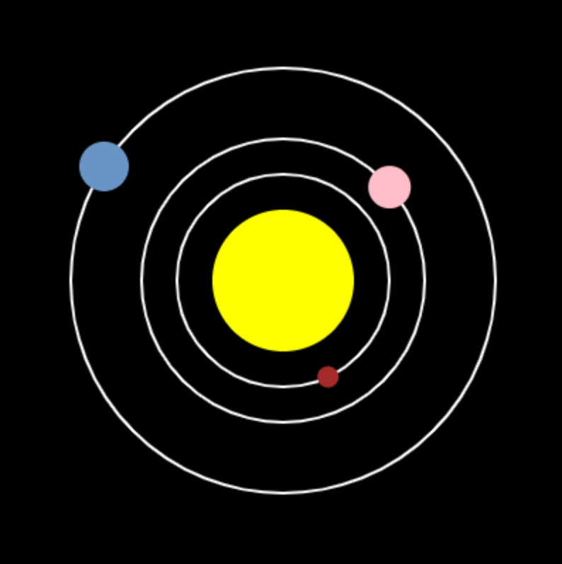

  <a class="c-survey-banner__link" href="https://form.raspberrypi.org/f/code-editor-feedback" target="_blank">Participe à notre enquête</a> pour nous aider à améliorer notre Code Editor !

## Ce que tu vas faire

Apprends les dictionnaires Python en créant un modèle du système solaire.

--- no-print ---

--- task ---
### Joue ▶️

  
Exécute le programme pour créer le modèle. Essaie de cliquer sur chaque planète pour découvrir des informations à son sujet.

<iframe src="https://editor.raspberrypi.org/fr-FR/embed/viewer/solar-system-example" width="600" height="600" frameborder="0" marginwidth="0" marginheight="0" allowfullscreen>
</iframe>

--- /task ---

--- /no-print ---

--- print-only ---

--- /print-only ---

**Les limites des modèles :** même les modèles très avancés laissent de côté des détails pour faciliter leur conception et leur fonctionnement. En fait, il n'est pas possible de réaliser un modèle précis de l'ensemble du système solaire, car toutes les planètes s'attirent les unes les autres en raison de la gravité. Par conséquent, les mathématiques permettant de prédire exactement où elles iront n'ont pas encore été inventées.

 Ce modèle utilise l'ordre des planètes, ainsi que leurs vitesses et leurs tailles. Mais Mercure, par exemple, doit être suffisamment lente pour que l'on puisse cliquer dessus. Le modèle rend donc Mercure plus rapide que les autres planètes, mais pas autant qu'elle ne l'est en réalité.

Tu vas :
 - Utiliser des **dictionnaires** pour stocker et rechercher des données
 - Charger les données d'un fichier dans les **dictionnaires**
 - Créer un modèle animé et interactif du système solaire en utilisant la bibliothèque `p5`

**Dictionnaires :** lorsque tu fais un dictionnaire Python, il stocke des choses que tu peux rechercher plus tard. Ce dictionnaire ressemble beaucoup à un dictionnaire normal. Mais la version Python peut stocker bien plus que la signification des mots !

