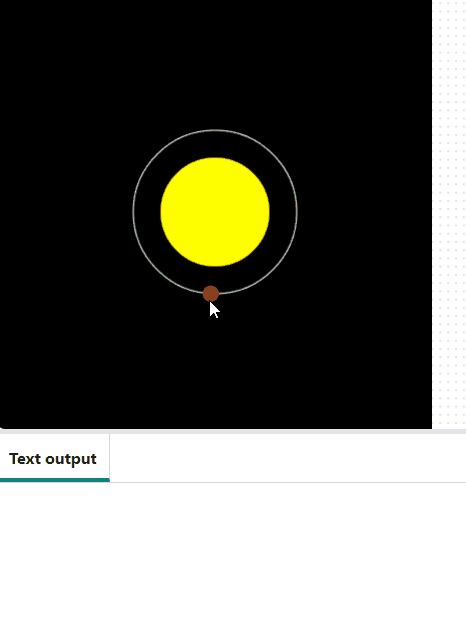

## Créer Mercure

Maintenant, tu vas mettre Mercure en orbite autour du soleil.

{:width="300px"}

### Dessiner Mercure

La fonction `creer_planete()` est écrite dans un fichier séparé qui est inclus dans le projet de démarrage et importé dans `main.py` pour que tu puisses l'utiliser.

`creer_planete()` utilise la couleur, l'orbite, la taille et la vitesse d'une planète pour dessiner la planète en orbite autour du soleil.

--- task ---

Trouve le commentaire `# Fonction dessiner_planetes`. Crée la fonction en dessous.

Crée des variables pour stocker les valeurs nécessaires pour dessiner Mercure. Appelle ensuite `creer_planete()`, en lui transmettant ces valeurs.

[[[parameters]]]

--- code ---
---
language: python filename: main.py — draw_planets() line_numbers: true line_number_start: 17
line_highlights: 18-29
---
# draw_planets function
def draw_planets(): colour = mercury['colour'] orbit = mercury['orbit'] size = mercury['size'] speed = mercury['speed']

    make_planet(
        colour, 
        orbit, 
        size, 
        speed
    )
--- /code ---

**Astuce :** tu as créé ton dictionnaire avec une ligne pour chaque paire `clé: valeur`. Tu peux faire de même lorsque tu passes des valeurs à une fonction pour rendre ton code plus facile à lire.

--- /task ---

--- task ---

Ajoute un appel à `dessiner_planetes()` dans la fonction `dessiner()`.

--- code ---
---
language: python filename: main.py — draw() line_numbers: true line_number_start: 50
line_highlights: 56
---
def draw(): # Put code to run every frame here background(0) no_stroke() draw_sun() draw_orbits() draw_planets() --- /code ---

--- /task ---

--- task ---

**Test :** exécute ton code et vois Mercure en orbite !

{:width="400px"}

**Débogage :** si tu obtiens un message de type "KeyError", vérifie l'orthographe de tes clés dans `creer_planete()`. Assure-toi que l'orthographe est la même dans `charger_planetes()`. Le fait que les lettres soient en majuscules ou en minuscules est également important.

**Débogage :** si Mercure n'apparaît pas :
 - Vérifie que tu appelles bien `dessiner_planetes()` dans `dessiner()`
 - Assure-toi que cet appel se situe après `background(0)`

**Débogage :** si Mercure est trop grande, trop lente ou non visible, vérifie que ton code `dessiner_planetes()` est le même que celui de l'exemple. Vérifie notamment que les clés sont dans le bon ordre.

--- /task ---

### Parler de la planète aux utilisateurs

Les utilisateurs cliqueront sur Mercure et ton programme imprimera les informations dans `mercure['info']`.

La fonction `mouse_pressed()` a été incluse dans le projet de démarrage. Elle contient du code pour obtenir la valeur hexadécimale d'une couleur sur laquelle un utilisateur a cliqué. Tu peux t'en servir pour savoir sur quelle planète ils ont cliqué.

--- task ---

Trouve `mouse_pressed()` et ajoute une instruction `if`. Fais en sorte qu'il `imprime` le nom et les informations de Mercure lorsque l'utilisateur clique sur la planète.

--- code ---
---
language: python filename: main.py — mouse_pressed() line_numbers: true line_number_start: 60
line_highlights: 64-66
---
def mouse_pressed(): # Put code to run when the mouse is pressed here pixel_colour = Color(get(mouse_x, mouse_y)).hex  # Here the RGB value is converted to Hex so it can be used in a string comparison later

    if pixel_colour == mercury['colour'].hex:
        print(mercury['name'])
        print(mercury['info'])

--- /code ---

--- /task ---

Lorsque l'utilisateur clique sur un pixel, la valeur de la couleur hexadécimale du pixel est récupérée et comparée aux couleurs des planètes. Si la couleur du pixel est la même que celle d'une planète, des informations sur cette planète s'affichent.

--- task ---

**Test :** exécute ton code et clique sur Mercure pour voir ses informations s'imprimer. Si elle se déplace trop vite, modifie la valeur `frame_rate` dans la fonction `run()` pour ralentir l'ensemble du modèle.

{:width="400px"}

**Débogage :** si rien ne se passe lorsque tu cliques sur Mercure, vérifie ta déclaration `if`. Assure-toi qu'elle ressemble exactement à l'exemple ci-dessus. Vérifie que tu as bien `==` et non `=`.

**Débogage :** si tu obtiens un message de type "KeyError", vérifie l'orthographe de tes clés (`'nom'` et `'info'`) dans `mouse_pressed()`. Assure-toi que l'orthographe est la même dans `charger_planetes()`.

--- /task ---

--- save ---
