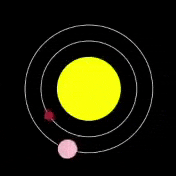

## Créer Vénus

<div style="display: flex; flex-wrap: wrap">
<div style="flex-basis: 200px; flex-grow: 1; margin-right: 15px;">
Il est temps pour Vénus de rejoindre Mercure dans ton modèle.
</div>
<div>

</div>
</div>

Les valeurs des autres planètes se trouvent dans le fichier `planets.csv`.

--- collapse ---
---
title: Que contient planets.csv ?
---

Le fichier `planets.csv` comporte une ligne de titres, suivie d'une ligne pour chaque planète du système solaire. La couleur d'une planète est composée de trois valeurs : une pour le rouge, une pour le vert et une pour le bleu. Par exemple :

```
planete,couleur_r,couleur_g,couleur_b,taille,orbite,vitesse,info
Mercure,165,42,42,15,150,1,La plus petite et la plus rapide des planètes.
Vénus,255,190,200,30,200,0.75,La planète la plus chaude du système solaire. L'eau s'y transformerait en vapeur et certains métaux fondraient rien qu'en s'y trouvant !
Terre,104,149,197,35,300,0.5,Tu es ici. La seule planète que nous connaissons qui puisse abriter la vie.
```

--- /collapse ---

### Charger les données

--- task ---

Ajoute une variable `global` pour Vénus à ta fonction `charger_planetes()` :

--- code ---
---
language: python
filename: main.py — load_planets()
line_numbers: true
line_number_start: 32
line_highlights: 33
---
# Fonction charger_planetes
def charger_planetes():
    global mercure, venus
--- /code ---

--- /task ---

--- task ---

Sous ton dictionnaire `mercure`, charge `planets.csv` dans une variable `donnees`. Utilise ensuite la fonction `splitlines()` pour diviser la chaîne de texte contenue dans `donnees` en une liste. Chaque ligne de la chaîne devient un élément de la liste.

[[[generic-python-file-read]]]

--- code ---
---
language: python
filename: main.py — load_planets()
line_numbers: true
line_number_start: 35
line_highlights: 44-46
---

    mercure = {
        'nom': 'Mercure',
        'couleur': Color(165, 42, 42),
        'taille': 15,
        'orbite': 150,
        'vitesse': 1,
        'info': 'La plus petite et la plus rapide des planètes.'
    }
    
    with open('planets.csv') as f:
        donnees = f.read()
        lignes = donnees.splitlines()
--- /code ---

--- /task ---

Tu as maintenant les données dans ton programme. Ensuite, tu transformeras ces données en dictionnaires, comme celui que tu as créé pour Mercure. `lignes[2]` a les données pour Vénus, et `lignes[3]` a les données pour la Terre.

--- task ---

Divise `lignes[2]` au niveau des virgules et stocke-la dans `planete`. Puis imprime `planete` en sortie.

--- code ---
---
language: python
filename: main.py — load_planets()
line_numbers: true
line_number_start: 44
line_highlights: 48-49
---

    with open('planets.csv') as f:
        donnees = f.read()
        lignes = donnees.splitlines()
    
    planete = lignes[2].split(',')  # Diviser les données de Vénus
    print(planete)
--- /code ---

--- /task ---

--- task ---

**Test :** essaie d'exécuter ton code, et regarde la liste des données qu'il imprime. Remarque que les chiffres sont entre guillemets `'`. Cela montre que Python les considère comme des chaînes de texte, et non comme des nombres avec lesquels il pourrait faire des calculs.


**Débogage :** si ta `planete` imprime une liste avec un seul élément, alors vérifie que tu as bien `','` dans le `()` de `lignes[2].split()`.

**Débogage :** si tu vois un message indiquant que `split` est "non défini", vérifie que tu as bien inclus `lignes[2].` avant lui.

**Débogage :** si tu vois un message `'list' object has no attribute 'split'`, vérifie que tu as bien inclus `[2]` après `lignes`.

**Astuce :** maintenant que tu l'as utilisé pour tester, tu peux commenter `print(planete)` avec `#`.

--- /task ---

--- task ---

Charge la liste des valeurs de `planete` dans un dictionnaire `venus`. Lorsque tu créeras le dictionnaire, change tous les nombres de texte en nombres. Utilise `int()` pour les nombres entiers et `float()` pour les décimales.

--- code ---
---
language: python
filename: main.py — load_planets()
line_numbers: true
line_number_start: 44
line_highlights: 50-57
---

    with open('planets.csv') as f:
        donnees = f.read()
        lignes = donnees.splitlines()
    
    planete = lignes[2].split(',')  # Diviser les données de Vénus
    #print(planete)
    venus = { 
        'nom': planete[0],
        'couleur': Color(int(planete[1]), int(planete[2]), int(planete[3])),  # Transformez-les en chiffres
        'taille': int(planete[4]),  # int() pour les nombres entiers
        'orbite': int(planete[5]),
        'vitesse': float(planete[6]),  # float() pour les décimales
        'info': planete[7]
    }
--- /code ---

--- /task ---

--- task ---

### Dessiner l'orbite

Va dans ta fonction `dessiner_orbites()` et ajoute l'orbite de Vénus.

--- code ---
---
language: python
filename: main.py — draw_orbits()
line_numbers: true
line_number_start: 10
line_highlights: 16
---
# Fonction dessiner_orbites
def dessiner_orbites():
    no_fill()
    stroke(255) # Rendre blanc

    ellipse(width / 2, height / 2, mercury['orbite'], mercure['orbite'])
    ellipse(width / 2, height / 2, venus['orbite'], venus['orbite'])

--- /code ---

--- /task ---

--- task ---

**Test :** exécute ton code et vois apparaître l'orbite de Vénus.


**Débogage :** si tu vois un message indiquant que `venus` n'est pas "défini", vérifie `charger_planetes()`. Assure-toi d'avoir déclaré `venus` comme `global`.

--- /task ---

### Dessiner la planète

--- task ---

Va dans ta fonction `dessiner_planetes()`. Ajoute un appel `creer_planete()`, en lui transmettant les valeurs pour Vénus.

**Astuce :** tu peux copier et coller le code que tu as utilisé pour créer Mercure afin de gagner du temps et d'éviter les fautes de frappe. Il suffit de changer toutes les mentions de `mercure` en `venus` dans la copie.

--- collapse ---
---
title: Copier et coller
---

Tu peux copier du texte et coller une copie à un autre endroit.

 1. Sélectionne le texte que tu veux copier en faisant glisser ta souris dessus tout en maintenant le bouton gauche enfoncé.
 2. Copie le texte en utilisant le menu de ton navigateur - choisis **Editer** > **Copier**. Tu peux aussi utiliser un raccourci clavier - <kbd>Ctrl</kbd>+<kbd>C</kbd> sous Windows ou Linux, ou <kbd>Cmd</kbd>+<kbd>C</kbd> sur Mac.
 3. Déplace ton curseur de texte (la ligne clignotante qui indique l'endroit où tu es en train de taper) à l'endroit où tu veux placer une copie du texte.
 4. Colle le texte en utilisant le menu de ton navigateur - choisis **Editer** > **Coller**. Tu peux aussi utiliser un raccourci clavier - <kbd>Ctrl</kbd>+<kbd>V</kbd> sous Windows ou Linux, ou <kbd>Cmd</kbd>+<kbd>V</kbd> sur un Mac.

Tu peux ensuite apporter toutes les modifications nécessaires à la copie.

{:width="300px"}

--- /collapse ---

--- code ---
---
language: python
filename: main.py — draw_planets()
line_numbers: true
line_number_start: 18
line_highlights: 31-41
---
# Fonction dessiner_planetes
def dessiner_planetes():
    couleur = mercure['couleur']
    orbite = mercure['orbite']
    taille = mercure['taille']
    vitesse = mercure['vitesse']

    creer_planete(
        couleur, 
        orbite, 
        taille, 
        vitesse
    )
    
    couleur = venus['couleur']
    orbite = venus['orbite']
    taille = venus['taille']
    vitesse = venus['vitesse']
    
    creer_planete(
        couleur, 
        orbite, 
        taille, 
        vitesse
    )
--- /code ---

--- /task ---

--- task ---

**Test :** exécute ton code et vérifie que Vénus tourne autour du Soleil.

{:width="400px"}

**Débogage :** si tu obtiens un message de type "KeyError", vérifie l'orthographe de tes clés dans `creer_planete()`. Assure-toi que l'orthographe est la même dans `charger_planetes()`. Le fait que les lettres soient en majuscules ou en minuscules est également important.

**Débogage :** si une planète est trop grande, trop lente ou non visible, vérifie que ton code `dessiner_planetes()` est le même que celui de l'exemple. Vérifie notamment que les clés sont dans le bon ordre.

--- /task ---

### Parler de Venus aux utilisateurs

Comme Mercure, Vénus devrait imprimer une information intéressante lorsqu'on clique dessus.

--- task ---

Dans `mouse_pressed()`, ajoute des instructions `elif` après l'instruction `if` que tu as faite pour Mercure. Fais-le vérifier la couleur de Vénus. Ensuite, s'il y a une correspondance, `print()` la bonne information.

--- code ---
---
language: python
filename: main.py — mouse_pressed()
line_numbers: true
line_number_start: 83
line_highlights: 87-92
---
def mouse_pressed():
    # Mettre le code à exécuter lorsque la souris est pressée ici
    couleur_pixel = Color(get(mouse_x, mouse_y)).hex  # Ici, la valeur RVB est convertie en hexadécimal afin de pouvoir être utilisée ultérieurement dans une comparaison de chaînes de caractères

    if couleur_pixel == mercure['couleur'].hex:
        print(mercure['nom'])
        print(mercure['info'])
    elif couleur_pixel == venus['couleur'].hex:
        print(venus['nom'])
        print(venus['info'])

--- /code ---

--- /task ---

--- task ---

**Test :** exécute ton code. Clique sur Vénus pour voir ses informations imprimées.

{:width="400px"}

**Débogage :** si rien ne se passe lorsque tu cliques sur Vénus, vérifie sa déclaration `elif`. Assure-toi qu'elle ressemble exactement à l'exemple ci-dessus. Vérifie que tu as bien `==` et non `=`.

--- /task ---

--- save ---
