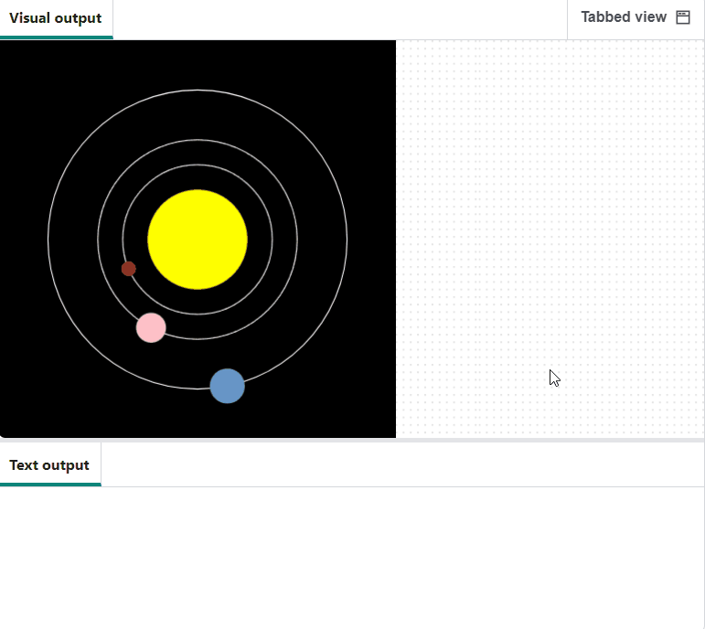

## Créer la Terre

Maintenant, termine le modèle en ajoutant la planète sur laquelle tu te trouves !

{:width="400px"}

### Charger les données

--- task ---

Ajoute une variable `global` pour la Terre à ta fonction `charger_planetes()` :

--- code ---
---
language: python filename: main.py — load_planets() line_numbers: true line_number_start: 47
line_highlights: 49
---
# load_planets function
def load_planets(): global mercury, venus, earth --- /code ---

--- /task ---

Tu as déjà les données dans ton programme : les données de la Terre ont été chargées dans `lignes` lorsque tu as chargé `planets.csv`.

--- task ---

En dessous de ton dictionnaire `venus`, divise `lignes[3]` et mets-le dans un dictionnaire `terre`.

**Astuce :** tu peux copier et coller le code que tu as utilisé pour réaliser le dictionnaire `venus` pour te faire gagner du temps. Ensuite, il suffit de faire de petits changements - `lignes[2]` en `lignes[3]`, et `venus` en `terre`.

--- code ---
---
language: python filename: main.py — load_planets() line_numbers: true line_number_start: 56
line_highlights: 71-79
---

    with open('planets.csv') as f:
        data = f.read()
        lines = data.splitlines()
    
    planet = lines[2].split(',')
    #print(planet)
    venus = { 
        'name': planet[0],
        'colour': Color(int(planet[1]), int(planet[2]), int(planet[3])),
        'size': int(planet[4]), 
        'orbit': int(planet[5]),
        'speed': float(planet[6]), 
        'info': planet[7]
    }
    
    planet = lines[3].split(',') 
    earth = { 
        'name': planet[0],
        'colour': Color(int(planet[1]), int(planet[2]), int(planet[3])),
        'size': int(planet[4]), 
        'orbit': int(planet[5]),
        'speed': float(planet[6]), 
        'info': planet[7]
    }

--- /code ---

--- /task ---

### Dessiner l'orbite

Va dans ta fonction `dessiner_orbites()` et ajoute l'orbite de la Terre.

--- code ---
---
language: python filename: main.py — draw_orbits() line_numbers: true line_number_start: 10
line_highlights: 17
---
# draw_orbits function
def draw_orbits(): no_fill() stroke(255)  # Make it white

    ellipse(width / 2, height / 2, mercury['orbit'], mercury['orbit'])
    ellipse(width / 2, height / 2, venus['orbit'], venus['orbit'])
    ellipse(width / 2, height / 2, earth['orbit'], earth['orbit'])

--- /code ---

--- /task ---

--- task ---

 **Test :** exécute ton code et vois apparaître l'orbite de la Terre.

**Débogage :** si tu vois un message indiquant que `terre` n'est pas "défini", vérifie `charger_planetes()`. Assure-toi d'avoir déclaré `terre` comme `global`.

--- /task ---

### Dessiner la Terre

--- task ---

Va dans ta fonction `dessiner_planetes()`. Ajoute un appel `creer_planete()`, en lui transmettant les valeurs pour la Terre. Comme pour Vénus, tu peux copier et coller du code ici pour t'épargner du travail.

--- code ---
---
language: python filename: main.py — draw_planets() line_numbers: true line_number_start: 19
line_highlights: 45-55
---
# draw_planets function
def draw_planets(): colour = mercury['colour'] orbit = mercury['orbit'] size = mercury['size'] speed = mercury['speed']

    make_planet(
        colour, 
        orbit, 
        size, 
        speed
    )
    
    colour = venus['colour']
    orbit = venus['orbit']
    size = venus['size']
    speed = venus['speed']
    
    make_planet(
        colour, 
        orbit, 
        size, 
        speed
    )
    
    colour = earth['colour']
    orbit = earth['orbit']
    size = earth['size']
    speed = earth['speed']
    
    make_planet(
        colour, 
        orbit, 
        size, 
        speed
    )

--- /code ---

--- /task ---

--- task ---

**Test :** exécute ton code et vérifie que la Terre tourne autour du Soleil.

{:width="400px"}

**Débogage :** si tu obtiens un message de type "KeyError", vérifie l'orthographe de tes clés dans `creer_planete()`. Assure-toi que l'orthographe est la même dans `charger_planetes()`. Le fait que les lettres soient en majuscules ou en minuscules est également important.

**Débogage :** si une planète est trop grande, trop lente ou non visible, vérifie que ton code `dessiner_planetes()` est le même que celui de l'exemple. Vérifie notamment que les clés sont dans le bon ordre.

--- /task ---

### Parler de la Terre aux utilisateurs

Comme Mercure et Vénus, la Terre devrait imprimer une information intéressante lorsqu'on clique dessus.

--- task ---

Dans `mouse_pressed()`, ajoute une instruction `elif` pour la Terre comme celle que tu as faite pour Vénus. Fais en sorte qu'elle vérifie la couleur de la Terre. Ensuite, s'il y a une correspondance, `print()` la bonne information.

--- code ---
---
language: python filename: main.py — mouse_pressed() line_numbers: true line_number_start: 108
line_highlights: 118-120
---
def mouse_pressed(): # Put code to run when the mouse is pressed here pixel_colour = Color(get(mouse_x, mouse_y)).hex  # Here the RGB value is converted to Hex so it can be used in a string comparison later

    if pixel_colour == mercury['colour'].hex:
        print(mercury['name'])
        print(mercury['info'])
    elif pixel_colour == venus['colour'].hex:
        print(venus['name'])
        print(venus['info'])
    elif pixel_colour == earth['colour'].hex:
        print(earth['name'])
        print(earth['info'])

--- /code ---

--- /task ---

--- task ---

**Test :** exécute ton code. Clique sur la Terre pour voir ses informations imprimées.

{:width="400px"}

**Débogage :** si rien ne se passe lorsque tu cliques sur la Terre, vérifie sa déclaration `elif`. Assure-toi qu'elle ressemble exactement à l'exemple ci-dessus. Vérifie que tu as bien `==` et non `=`.

--- /task ---

--- save ---
