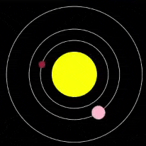
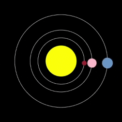

## Créer la Terre

Maintenant, termine le modèle en ajoutant la planète sur laquelle tu te trouves !

{:width="400px"}

### Charger les données

--- task ---

Ajoute une variable `global` pour la Terre à ta fonction `charger_planetes()` :

--- code ---
---
language: python
filename: main.py — load_planets()
line_numbers: true
line_number_start: 47
line_highlights: 49
---
# Fonction charger_planetes
def charger_planetes():
    global mercure, venus, terre
--- /code ---

--- /task ---

Tu as déjà les données dans ton programme : les données de la Terre ont été chargées dans `lignes` lorsque tu as chargé `planets.csv`.

--- task ---

En dessous de ton dictionnaire `venus`, divise `lignes[3]` et mets-le dans un dictionnaire `terre`.

**Astuce :** tu peux copier et coller le code que tu as utilisé pour réaliser le dictionnaire `venus` pour te faire gagner du temps. Ensuite, il suffit de faire de petits changements - `lignes[2]` en `lignes[3]`, et `venus` en `terre`.

--- code ---
---
language: python
filename: main.py — load_planets()
line_numbers: true
line_number_start: 56
line_highlights: 71-79
---

    with open('planets.csv') as f:
        donnees = f.read()
        lignes = donnees.splitlines()
    
    planete = lignes[2].split(',')
    #print(planete)
    venus = { 
        'nom': planete[0],
        'couleur': Color(int(planete[1]), int(planete[2]), int(planete[3])),
        'taille': int(planete[4]), 
        'orbite': int(planete[5]),
        'vitesse': float(planete[6]), 
        'info': planete[7]
    }
    
    planete = lines[3].split(',') 
    terre = { 
        'nom': planete[0],
        'couleur': Color(int(planete[1]), int(planete[2]), int(planete[3])),
        'taille': int(planete[4]), 
        'orbite': int(planete[5]),
        'vitesse': float(planete[6]), 
        'info': planete[7]
    }

--- /code ---

--- /task ---

### Dessiner l'orbite

--- task ---

Va dans ta fonction `dessiner_orbites()` et ajoute l'orbite de la Terre.

--- code ---
---
language: python
filename: main.py — draw_orbits()
line_numbers: true
line_number_start: 10
line_highlights: 17
---
# Fonction dessiner_orbites
def dessiner_orbites():
    no_fill()
    stroke(255)  # Rendre blanc

    ellipse(width / 2, height / 2, mercure['orbite'], mercure['orbite'])
    ellipse(width / 2, height / 2, venus['orbite'], venus['orbite'])
    ellipse(width / 2, height / 2, terre['orbite'], terre['orbite'])

--- /code ---

--- /task ---

--- task ---

 **Test :** exécute ton code et vois apparaître l'orbite de la Terre.

**Débogage :** si tu vois un message indiquant que `terre` n'est pas "défini", vérifie `charger_planetes()`. Assure-toi d'avoir déclaré `terre` comme `global`.

--- /task ---

### Dessiner la Terre

--- task ---

Va dans ta fonction `dessiner_planetes()`. Ajoute un appel `creer_planete()`, en lui transmettant les valeurs pour la Terre. Comme pour Vénus, tu peux copier et coller du code ici pour t'épargner du travail.

--- code ---
---
language: python
filename: main.py — draw_planets()
line_numbers: true
line_number_start: 19
line_highlights: 45-55
---
# Fonction dessiner_planetes
def dessiner_planetes():
    couleur = mercure['couleur']
    orbite = mercure['orbite']
    taille = mercure['taille']
    vitesse = mercure['vitesse']

    creer_planete(
        couleur, 
        orbite, 
        taille, 
        vitesse
    )
    
    couleur = venus['couleur']
    orbite = venus['orbite']
    taille = venus['taille']
    vitesse = venus['vitesse']
    
    creer_planete(
        couleur, 
        orbite, 
        taille, 
        vitesse
    )
    
    couleur = terre['couleur']
    orbite = terre['orbite']
    taille = terre['taille']
    vitesse = terre['vitesse']
    
    creer_planete(
        couleur, 
        orbite, 
        taille, 
        vitesse
    )

--- /code ---

--- /task ---

--- task ---

**Test :** exécute ton code et vérifie que la Terre tourne autour du Soleil.

{:width="400px"}

**Débogage :** si tu obtiens un message de type "KeyError", vérifie l'orthographe de tes clés dans `creer_planete()`. Assure-toi que l'orthographe est la même dans `charger_planetes()`. Le fait que les lettres soient en majuscules ou en minuscules est également important.

**Débogage :** si une planète est trop grande, trop lente ou non visible, vérifie que ton code `dessiner_planetes()` est le même que celui de l'exemple. Vérifie notamment que les clés sont dans le bon ordre.

--- /task ---

### Parler de la Terre aux utilisateurs

Comme Mercure et Vénus, la Terre devrait imprimer une information intéressante lorsqu'on clique dessus.

--- task ---

Dans `mouse_pressed()`, ajoute une instruction `elif` pour la Terre comme celle que tu as faite pour Vénus. Fais en sorte qu'elle vérifie la couleur de la Terre. Ensuite, s'il y a une correspondance, `print()` la bonne information.

--- code ---
---
language: python
filename: main.py — mouse_pressed()
line_numbers: true
line_number_start: 108
line_highlights: 118-120
---
def mouse_pressed():
    # Mettre le code à exécuter lorsque la souris est pressée ici
    couleur_pixel = Color(get(mouse_x, mouse_y)).hex  # Ici, la valeur RVB est convertie en hexadécimal afin de pouvoir être utilisée ultérieurement dans une comparaison de chaînes de caractères

    if couleur_pixel == mercure['couleur'].hex:
        print(mercure['nom'])
        print(mercure['info'])
    elif couleur_pixel == venus['couleur'].hex:
        print(venus['nom'])
        print(venus['info'])
    elif couleur_pixel == terre['couleur'].hex:
        print(terre['nom'])
        print(terre['info'])

--- /code ---

--- /task ---

--- task ---

**Test :** exécute ton code. Clique sur la Terre pour voir ses informations imprimées.

{:width="400px"}

**Débogage :** si rien ne se passe lorsque tu cliques sur la Terre, vérifie sa déclaration `elif`. Assure-toi qu'elle ressemble exactement à l'exemple ci-dessus. Vérifie que tu as bien `==` et non `=`.

--- /task ---

--- save ---
