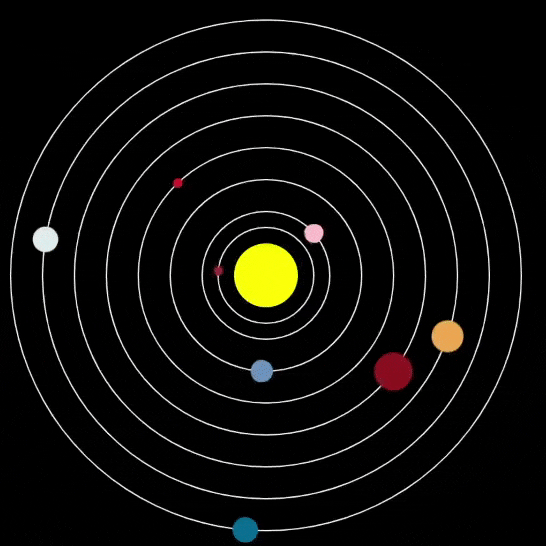

## Améliorer ton projet

Dans cette étape, ajoute d'autres planètes à ton modèle, ou modifie celles que tu as.

{:width="300px"}

### Ajouter plus de planètes
Le fichier `planets.csv` contient également des informations sur les cinq autres planètes. Ajoutes-en autant que tu le souhaites.

--- task ---

Pour ajouter une planète à ton modèle, tu devras :
 - Ajouter du code pour le charger dans `charger_planetes()`
 - Ajouter du code pour dessiner son orbite dans `dessiner_orbites()`
 - Ajouter du code pour dessiner la planète dans `dessiner_planetes()`
 - Ajouter du code pour savoir quand la planète est cliquée, et imprimer ses informations dans `mouse_pressed()`

 **Astuce :** n'oublie pas que tu peux copier et coller du code !

--- /task ---

--- task ---

Augmente la `taille()` dans ta fonction `configuration()` pour que le modèle soit assez grand pour voir tes nouvelles planètes ; `size(900, 900)` les fera toutes rentrer.

--- /task ---

### Créer une planète !

--- task ---

Ajoute une planète supplémentaire au système solaire. Crée une nouvelle variable `global` avec un dictionnaire pour elle. Ensuite, ajoute du code pour la dessiner et pour imprimer ses informations.

--- /task ---

--- collapse ---
---
title: Le projet terminé
---

Tu peux voir le [projet terminé ici](https://editor.raspberrypi.org/fr-FR/projects/solar-system-example){:target="_blank"}.

--- /collapse ---

--- save ---
