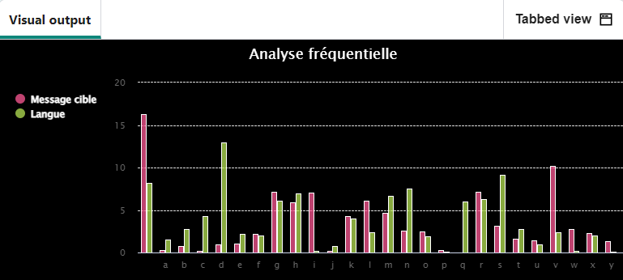

## Et ensuite ?

Si tu suis le parcours [Plus de Python](https://projects.raspberrypi.org/fr-FR/pathways/more-python), tu peux passer au projet [Codebreaker](https://projects.raspberrypi.org/fr-FR/projects/codebreaker/). Dans ce projet, tu analyseras un graphique pour déchiffrer un code caché !

--- print-only ---

--- /print-only ---

--- no-print ---

<iframe src="https://editor.raspberrypi.org/fr-FR/embed/viewer/codebreaker-project-example" width="600" height="600" frameborder="0" marginwidth="0" marginheight="0" allowfullscreen>
</iframe>

--- /no-print ---

Si tu veux t'amuser davantage en explorant Python, tu peux essayer l'un de [ces projets](https://projects.raspberrypi.org/fr-FR/projects?software%5B%5D=python).

***

Ce projet a été traduit par des bénévoles:

Jonathan Vannieuwkerke
Michel Arnols

Grâce aux bénévoles, nous pouvons donner aux gens du monde entier la chance d'apprendre dans leur propre langue. Vous pouvez nous aider à atteindre plus de personnes en vous portant volontaire pour la traduction - plus d'informations sur [rpf.io/translate](https://rpf.io/translate).
