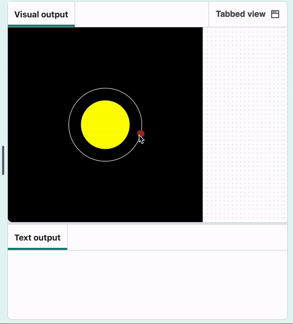

## Maak Mercurius

Nu ga je Mercurius in een baan om de zon brengen.

{:width="300px"}

### Teken Mercurius

De functie `maak_planeet()` is geschreven in een apart bestand dat is opgenomen als onderdeel van het startproject en geïmporteerd in `main.py` zodat je deze kan gebruiken.

`maak_planeet()` maakt gebruik van de kleur, baan, grootte en snelheid van een planeet om deze te laten draaien rond de zon.

--- task ---

Zoek de `# teken_planeten functie` opmerking. Maak de functie hieronder aan.

Maak variabelen om de waarden op te slaan die nodig zijn om Mercurius te tekenen. Roep vervolgens `maak_planeet()` aan en geef deze waarden door.

[[[parameters]]]

--- code ---
---
language: python filename: main.py — draw_planets() line_numbers: true line_number_start: 17
line_highlights: 18-29
---
# draw_planets function
def draw_planets(): colour = mercury['colour'] orbit = mercury['orbit'] size = mercury['size'] speed = mercury['speed']

    make_planet(
        colour, 
        orbit, 
        size, 
        speed
    )
--- /code ---

**Tip:** Je hebt je dictionary gemaakt met één regel voor elk `sleutel: waarde` paar. Je kunt hetzelfde doen bij het doorgeven van waarden aan een functie om je code gemakkelijker te kunnen lezen.

--- /task ---

--- task ---

Voeg een aanroep toe aan `teken_planeten()` in de `draw()` functie.

--- code ---
---
language: python filename: main.py — draw() line_numbers: true line_number_start: 50
line_highlights: 56
---
def draw(): # Put code to run every frame here background(0) no_stroke() draw_sun() draw_orbits() draw_planets() --- /code ---

--- /task ---

--- task ---

**Test:** Voer je code uit en zie Mercurius in de ruimte!

{:width="400px"}

**Debug:** Als je een bericht krijgt over 'KeyError', controleer dan de spelling van je sleutels in `maak_planeet()`. Zorg ervoor dat de spelling hetzelfde is als in `laad_planeten()`. Of de letters HOOFDLETTERS of kleine letters zijn, is ook belangrijk.

**Debug:** Als Mercurius niet verschijnt:
 - Controleer of je `teken_planeten()` aanroept in `draw()`
 - Zorg ervoor dat de aanroep na `background(0)`komt

**Debug:** Als Mercurius te groot, te langzaam of niet zichtbaar is, controleer dan of je `teken_planeten()` code hetzelfde is als in het voorbeeld. Controleer vooral of de sleutels in de juiste volgorde staan.

--- /task ---

### Vertel gebruikers over de planeet

Gebruikers klikken op Mercurius en je programma drukt de informatie af in `mercurius['info']`.

De functie `mouse_pressed()` is opgenomen als onderdeel van het startproject. Het bevat code om de hexadecimale waarde te verkrijgen van een kleur waarop een gebruiker heeft geklikt. Je kunt dit gebruiken om te zeggen op welke planeet ze hebben geklikt.

--- task ---

Vind `mouse_pressed()` en voeg een `if` statement toe. Laat het de naam en informatie van Mercurius `afdrukken` wanneer de gebruiker op de planeet klikt.

--- code ---
---
language: python filename: main.py — mouse_pressed() line_numbers: true line_number_start: 60
line_highlights: 64-66
---
def mouse_pressed(): # Put code to run when the mouse is pressed here pixel_colour = Color(get(mouse_x, mouse_y)).hex  # Here the RGB value is converted to Hex so it can be used in a string comparison later

    if pixel_colour == mercury['colour'].hex:
        print(mercury['name'])
        print(mercury['info'])

--- /code ---

--- /task ---

Wanneer de gebruiker op een pixel klikt, wordt de hex-kleurwaarde van de pixel opgehaald en vergeleken met de kleuren van de planeten. Als de pixelkleur hetzelfde is als de kleur van een planeet, wordt informatie over die planeet weergegeven.

--- task ---

**Test:** Voer je code uit en klik op Mercurius om de informatie te zien. Als hij te snel beweegt, verander dan de waarde `frame_rate` in de functie `run()` om het hele model te vertragen.

{:width="400px"}

**Debug:** Als er niets gebeurt wanneer je op Mercurius klikt, controleer dan je `if` statement. Zorg ervoor dat het er precies zo uitziet als in het bovenstaande voorbeeld. Controleer of je `==` hebt en niet `=`.

**Debug:** Als je een bericht krijgt over 'KeyError', Controleer de spelling van je sleutels (`'naam'` en `'info'`) in `mouse_pressed()`. Zorg ervoor dat de spelling hetzelfde is in `laad_planeten()`.

--- /task ---

--- save ---
