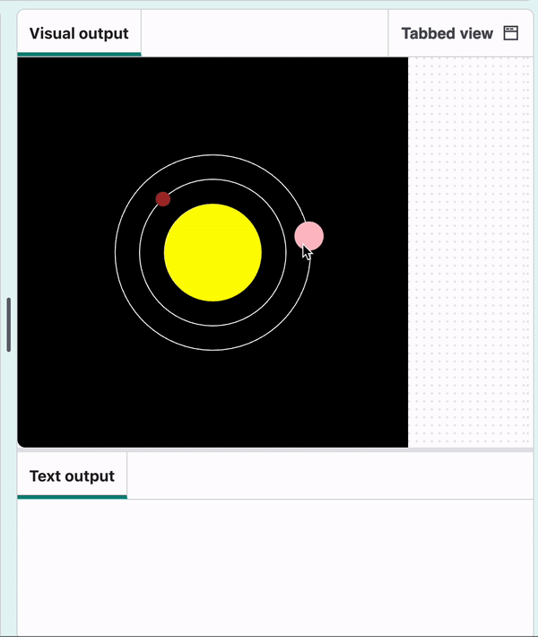
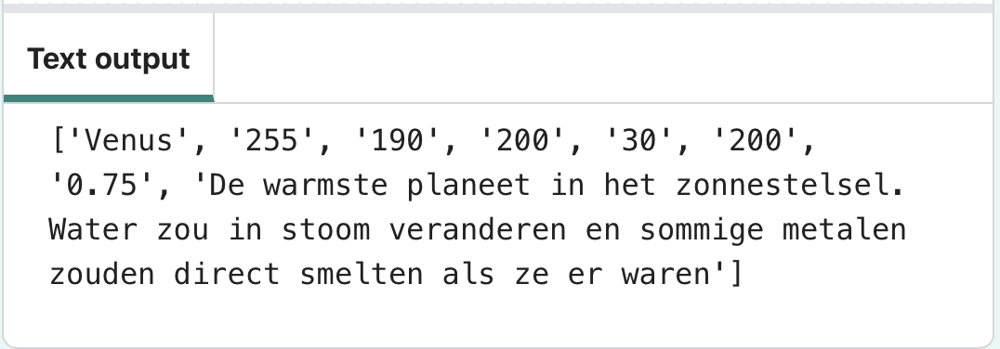
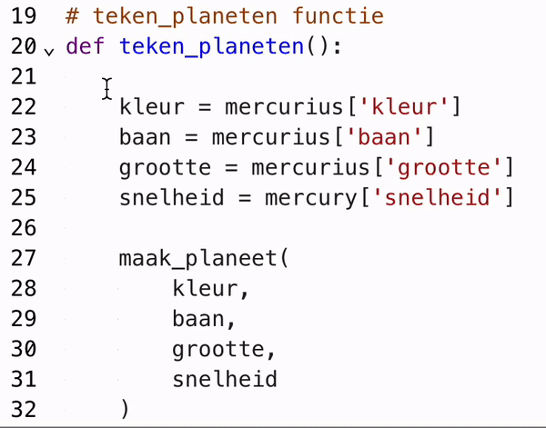
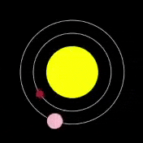

## Maak Venus

<div style="display: flex; flex-wrap: wrap">
<div style="flex-basis: 200px; flex-grow: 1; margin-right: 15px;">
Het is tijd voor Venus om mee te doen met Mercurius in jouw model.
</div>
<div>
{:width="300px"}
</div>
</div>

Waarden voor andere planeten staan in het bestand `planets.csv`.

--- collapse ---
---
title: Wat zit er in planets.csv?
---

Het bestand `planets.csv` heeft een rij kopjes, gevolgd door één regel voor elke planeet in het zonnestelsel. De kleur van een planeet bestaat uit drie waarden: één voor rood, groen en blauw. Bijvoorbeeld:

```
planeet,kleur_r,kleur_g,kleur_b,grootte,baan,snelheid,info
Mercurius,165,42,42,15,150,1,De kleinste en snelste planeet.
Venus,255,190,200,30,200,0.75,De warmste planeet in het zonnestelsel. Water zou in stoom veranderen en sommige metalen zouden smelten als ze er waren!
Aarde,104,149,197,35,300,0.5,Je bent hier – de enige planeet die we kennen die leven kan ondersteunen.
```

--- /collapse ---

### Laad de gegevens

--- task ---

Voeg een `global` variabele voor Venus toe aan je `laad_planeten()` functie:

--- code ---
---
language: python
filename: main.py — load_planets()
line_numbers: true
line_number_start: 32
line_highlights: 33
---
# laad_planeten functie
def laad_planeten():
    global mercurius, venus
--- /code ---

--- /task ---

--- task ---

Laad onder je `mercurius` dictionary `planets.csv` naar een `data` variabele. Gebruik vervolgens de functie `splitlines()` om de tekstreeks in `data` in een lijst te splitsen. Elke regel in de string wordt een item in de lijst.

[[[generic-python-file-read]]]

--- code ---
---
language: python
filename: main.py — load_planets()
line_numbers: true
line_number_start: 35
line_highlights: 44-46
---
    mercurius = {
        'naam': 'Mercurius',
        'kleur': Color(165, 42, 42),
        'grootte': 15,
        'baan': 150,
        'snelheid': 1,
        'info': 'De kleinste en snelste planeet.'
    }
    
    with open('planets.csv') as f:
        gegevens = f.read()
        lijnen = gegevens.splitlines()
--- /code ---

--- /task ---

Nu heb je de gegevens in je programma. Vervolgens maak je van die gegevens dictionaries, zoals degene die je voor Mercurius hebt gemaakt. `lijnen[2]` heeft de gegevens voor Venus, en `lijnen[3]` heeft de gegevens voor de aarde.

--- task ---

Splits `regels[2]` bij de komma's en sla deze op in `planeet`. Druk vervolgens `planeet` af.

--- code ---
---
language: python
filename: main.py — load_planets()
line_numbers: true
line_number_start: 44
line_highlights: 48-49
---
    with open('planets.csv') as f:
        gegevens = f.read()
        lijnen = gegevens.splitlines()

    planeet = lijnen[2].split(',')  # Splits de gegevens van Venus
    print(planeet)
--- /code ---

--- /task ---

--- task ---

**Test:** Probeer je code uit te voeren en kijk naar de data die hij afgedrukt. Merk op dat de getallen zich binnen aanhalingstekens `'` bevinden. Dit laat zien dat Python ze ziet als tekstreeksen, in plaats van getallen waarmee het zou kunnen rekenen.



**Debug:** Als je `planeet` een lijst afdrukt met slechts één item, controleer dan of je `','` in de `()` van `regels[2].split()` hebt.

**Debug:** Als je een bericht ziet dat `split` 'not defined' is, controleer dan of je `regels[2].` ervoor hebt toegevoegd.

**Debug:** Als je een bericht ziet als `'list' object heeft geen attribuut 'split'`, controleer dan of je `[2]` hebt opgenomen na `regels`.

**Tip:** Nu je het hebt gebruikt om het te testen, kun je `print(planeet)` met `#` in een comment veranderen.

--- /task ---

--- task ---

Laad de lijst met waarden van `planeet` in een `venus` dictionary. Terwijl je de dictionary maakt, verander je alle getallen van tekst in getallen. Gebruik `int()` voor hele getallen en `float()` voor decimalen.

--- code ---
---
language: python
filename: main.py — load_planets()
line_numbers: true
line_number_start: 44
line_highlights: 50-57
---
    with open('planets.csv') as f:
        gegevens = f.read()
        lijnen = gegevens.splitlines()

    planeet = lijnen[2].split(',')  # Splits de gegevens van Venus
    #print(planeet)
    venus = { 
        'naam': planeet[0],
        'kleur': Color(int(planeet[1]), int(planeet[2]), int(planeet[3])),  # Maak er getallen van
        'size': int(planeet[4]),  # int() voor hele getallen
        'orbit': int(planeet[5]),
        'speed': float(planeet[6]),  # float() voor decimalen
        'info': planeet[7]
    }
--- /code ---

--- /task ---

--- task ---

### Teken de baan

Ga naar je `teken_banen()` functie en voeg de baan van Venus toe.

--- code ---
---
language: python
filename: main.py — draw_orbits()
line_numbers: true
line_number_start: 10
line_highlights: 16
---
# teken_banen functie
def teken_banen():
    no_fill()
    stroke(255) # Maak het wit

    ellipse(width / 2, height / 2, mercurius['baan'], mercurius['baan'])
    ellipse(width / 2, height / 2, venus['baan'], venus['baan'])

--- /code ---

--- /task ---

--- task ---

**Test:** Voer je code uit en zie de baan van Venus verschijnen.


**Debug:** Als je een bericht ziet dat `venus` 'not defined' is, controleer dan `laad_planeten()`. Zorg ervoor dat je `venus`  hebt aangeduid als `global`.

--- /task ---

### Teken de planeet

--- task ---

Ga naar je `teken_planeten()` functie. Voeg een `maak_planeten()` aanroep toe, waarbij je de waarden voor Venus doorgeeft.

**Tip:** Je kunt de code die je hebt gebruikt om Mercurius te maken, kopiëren en plakken om wat tijd en typwerk te besparen. Verander gewoon alle vermeldingen van `mercurius` in `venus` in de kopie.

--- collapse ---
---
title: Kopiëren en plakken
---

Je kunt tekst kopiëren en een kopie op een andere plaats plakken.

 1. Selecteer de tekst die je wilt kopiëren door de muis erover te slepen terwijl je de linkerknop ingedrukt houdt.
 2. Kopieer de tekst via het menu van je browser - kies **Bewerken** > **Kopieer**. Je kunt ook een sneltoets gebruiken - <kbd>Ctrl</kbd>+<kbd>C</kbd> op Windows of Linux, of <kbd>Cmd</kbd>+<kbd>C</kbd> op een Mac.
 3. Verplaats je tekstcursor (de knipperende lijn die laat zien waar je typt) naar waar je een kopie van de tekst wilt plaatsen.
 4. Kopieer de tekst via het menu van je browser - kies **Bewerken** > **Plakken**. Je kunt ook een sneltoets gebruiken - <kbd>Ctrl</kbd>+<kbd>V</kbd> op Windows of Linux, of <kbd>Cmd</kbd>+<kbd>V</kbd> op een Mac.

Vervolgens kun je de gewenste wijzigingen in de kopie aanbrengen.

{:width="300px"}

--- /collapse ---

--- code ---
---
language: python
filename: main.py — draw_planets()
line_numbers: true
line_number_start: 18
line_highlights: 31-41
---
# teken_planeten functie
def teken_planeten():
    kleur = mercurius['kleur']
    baan = mercurius['baan']
    grootte = mercurius['grootte']
    snelheid = mercurius['snelheid']

    maak_planeet(
        kleur, 
        baan, 
        grootte, 
        snelheid
    )

    kleur = venus['kleur']
    baan = venus['baan']
    grootte = venus['grootte']
    snelheid = venus['snelheid']

    maak_planeet(
        kleur, 
        baan, 
        grootte, 
        snelheid
    )
--- /code ---

--- /task ---

--- task ---

**Test:** Voer je code uit en controleer of Venus om de zon draait.

{:width="400px"}

**Debug:** Als je een bericht krijgt over 'KeyError', controleer dan de spelling van je sleutels in `maak_planeet()`. Zorg ervoor dat de spelling hetzelfde is in `laad_planeten()`. Of de letters HOOFDLETTERS of kleine letters zijn, is ook belangrijk.

**Debug:** Als een planeet te groot, te langzaam of niet zichtbaar is, controleer dan of je `teken_planeten()` code hetzelfde is als in het voorbeeld. Controleer vooral of de sleutels in de juiste volgorde staan.

--- /task ---

### Vertel gebruikers over Venus

Net als Mercurius zou Venus een interessant feit moeten afdrukken wanneer erop wordt geklikt.

--- task ---

In `mouse_pressed()` voeg een `elif` statement toe na de `if` opdracht die je voor Mercurius hebt gemaakt. Laat deze controleren op de kleur van Venus. Als er dan een overeenkomst is, `print()` het juiste feit.

--- code ---
---
language: python
filename: main.py — mouse_pressed()
line_numbers: true
line_number_start: 83
line_highlights: 87-92
---
def mouse_pressed():
    # Zet code hier die moet worden uitgevoerd wanneer de muis wordt ingedrukt
    pixel_kleur = Color(get(mouse_x, mouse_y)).hex  # Hier wordt de RGB-waarde omgezet naar Hex, zodat deze later in een stringvergelijking kan worden gebruik

    if pixel_kleur == mercurius['kleur'].hex:
        print(mercurius['naam'])
        print(mercurius['info'])
    elif pixel_kleur == venus['kleur'].hex:
        print(venus['naam'])
        print(venus['info'])

--- /code ---

--- /task ---

--- task ---

**Test:** Voer je code uit. Klik op Venus om zijn informatie te zien.

{:width="400px"}

**Debug:** Als er niets gebeurt wanneer je op Venus klikt, controleer dan de instructie `elif`. Zorg ervoor dat het er precies zo uitziet als in het bovenstaande voorbeeld. Controleer of je `==` hebt en niet `=`.

--- /task ---

--- save ---
