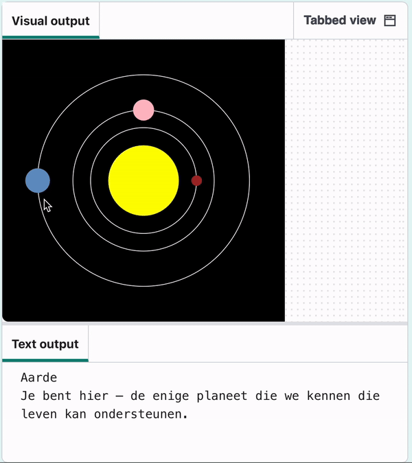
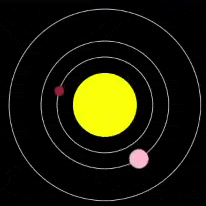
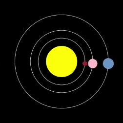

## Maak Aarde

Maak het model nu af door de planeet waarop je je bevindt toe te voegen!

{:width="400px"}

### Laad de gegevens

--- task ---

Voeg een `global` variabele voor Aarde toe aan je `laad_planeten()` functie:

--- code ---
---
language: python
filename: main.py — load_planets()
line_numbers: true
line_number_start: 47
line_highlights: 49
---
# laad_planeten functie
def laad_planeten():
    global mercurius, venus, aarde
--- /code ---

--- /task ---

Je hebt de gegevens al in je programma: de gegevens van de aarde zijn in `lijnen` geladen toen je `planets.csv`laadde.

--- task ---

Splits onder je `venus` dictionary `regels[3]` en plaats het in een `aarde` dictionary.

**Tip:** Je kunt de code kopiëren en plakken die je hebt gebruikt om de `venus` dictionary te maken, om je wat tijd te besparen. Vervolgens moet je gewoon kleine wijzigingen aanbrengen - `lijnen[2]` wordt `lijnen[3]`, en `venus` wordt `aarde`.

--- code ---
---
language: python
filename: main.py — load_planets()
line_numbers: true
line_number_start: 56
line_highlights: 71-79
---
    with open('planets.csv') as f:
        gegevens = f.read()
        lijnen = gegevens.splitlines()

    planeet = lijnen[2].split(',')
    #print(planeet)
    venus = { 
        'naam': planeet[0],
        'kleur': Color(int(planeet[1]), int(planeet[2]), int(planeet[3])),
        'grootte': int(planeet[4]), 
        'baan': int(planeet[5]),
        'snelheid': float(planeet[6]), 
        'info': planeet[7]
    }

    planet = lijnen[3].split(',') 
    earth = { 
        'naam': planeet[0],
        'kleur': Color(int(planeet[1]), int(planeet[2]), int(planeet[3])),
        'grootte': int(planeet[4]), 
        'baan': int(planeet[5]),
        'snelheid': float(planet[6]), 
        'info': planeet[7]
    }

--- /code ---

--- /task ---

### Teken de baan

--- task ---

Ga naar je `teken_banen()` functie en voeg de baan van Aarde toe.

--- code ---
---
language: python
filename: main.py — draw_orbits()
line_numbers: true
line_number_start: 10
line_highlights: 17
---
# teken_banen functie
def teken_banen():
    no_fill()
    stroke(255)  # Maak het wit

    ellipse(width / 2, height / 2, mercurius['baan'], mercurius['baan'])
    ellipse(width / 2, height / 2, venus['baan'], venus['baan'])
    ellipse(width / 2, height / 2, aarde['baan'], aarde['baan'])

--- /code ---

--- /task ---

--- task ---

 **Test:** Voer je code uit en zie de baan van Aarde verschijnen.

**Debug:** Als je een bericht ziet dat `aarde` 'not defined' is, controleer dan `laad_planeten()`. Zorg ervoor dat je `aarde`  hebt aangeduid als `global`.

--- /task ---

### Teken de aarde

--- task ---

Ga naar je `teken_planeten()` functie. Voeg een `maak_planeten()` aanroep toe, waarbij je de waarden voor Aarde doorgeeft. Net als bij Venus kun je hier code kopiëren en plakken om jezelf wat werk te besparen.

--- code ---
---
language: python
filename: main.py — draw_planets()
line_numbers: true
line_number_start: 19
line_highlights: 45-55
---
# teken_planeten functie
def teken_planeten():
    kleur = mercurius['kleur']
    baan = mercurius['baan']
    grootte = mercurius['grootte']
    snelheid = mercurius['snelheid']

    maak_planeet(
        kleur, 
        baan, 
        grootte, 
        snelheid
    )
    
    kleur = venus['kleur']
    baan = venus['baan']
    grootte = venus['grootte']
    snelheid = venus['snelheid']
    
    maak_planeet(
        kleur, 
        baan, 
        grootte, 
        snelheid
    )
    
    kleur = aarde['kleur']
    baan = aarde['baan']
    grootte = aarde['grootte']
    snelheid = aarde['snelheid']
    
    maak_planeet(
        kleur, 
        baan, 
        grootte, 
        snelheid
    )

--- /code ---

--- /task ---

--- task ---

**Test:** Voer je code uit en controleer of de aarde om de zon draait.

{:width="400px"}

**Debug:** Als je een bericht krijgt over 'KeyError', controleer dan de spelling van je sleutels in `maak_planeet()`. Zorg ervoor dat de spelling hetzelfde is in `laad_planeten()`. Of de letters HOOFDLETTERS of kleine letters zijn, is ook belangrijk.

**Debug:** Als een planeet te groot, te langzaam of niet zichtbaar is, controleer dan of je `teken_planeten()` code hetzelfde is als in het voorbeeld. Controleer vooral of de sleutels in de juiste volgorde staan.

--- /task ---

### Vertel gebruikers over de aarde

Net als Mercurius en Venus zou de aarde een interessant feit moeten afdrukken wanneer erop wordt geklikt.

--- task ---

In `mouse_pressed()` voeg `elif` statement toe voor Aarde zoals je hebt gemaakt voor Venus. Laat hem de kleur van de aarde controleren. Als er dan een overeenkomst is, `print()` het juiste feit.

--- code ---
---
language: python
filename: main.py — mouse_pressed()
line_numbers: true
line_number_start: 108
line_highlights: 118-120
---
def mouse_pressed():
    # Zet code hier die moet worden uitgevoerd wanneer de muis wordt ingedrukt
    pixel_kleur = Color(get(mouse_x, mouse_y)).hex  # Hier wordt de RGB-waarde omgezet naar Hex, zodat deze later in een stringvergelijking kan worden gebruikt

    if pixel_kleur == mercurius['kleur'].hex:
        print(mercurius['naam'])
        print(mercurius['info'])
    elif pixel_kleur == venus['kleur'].hex:
        print(venus['naam'])
        print(venus['info'])
    elif pixel_kleur == aarde['kleur'].hex:
        print(aarde['naam'])
        print(aarde['info'])

--- /code ---

--- /task ---

--- task ---

**Test:** Voer je code uit. Klik op Aarde om de informatie te zien.

{:width="400px"}

**Debug:** Als er niets gebeurt wanneer je op Aarde klikt, controleer dan de instructie `elif`. Zorg ervoor dat het er precies zo uitziet als in het bovenstaande voorbeeld. Controleer of je `==` hebt en niet `=`.

--- /task ---

--- save ---
