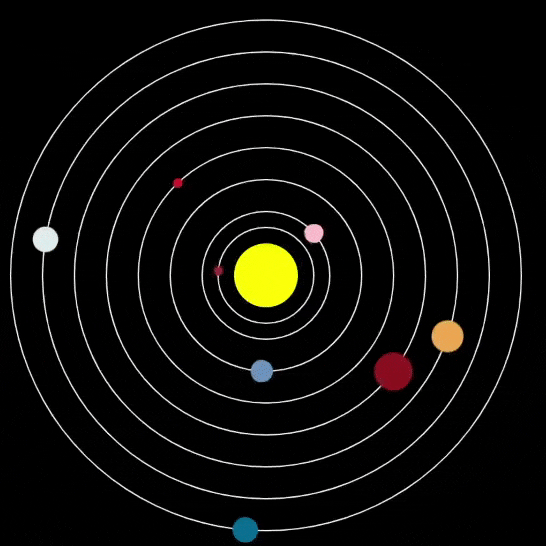

## Verbeter je project

In deze stap voeg je meer planeten toe aan je model, of verander je de planeten die je hebt.

{:width="300px"}

### Voeg meer planeten toe
Het `planets.csv` bestand bevat ook informatie voor de andere vijf planeten. Voeg er zoveel toe als je wilt.

--- task ---

Om een planeet aan je model toe te voegen, heb je het volgende nodig:
 - Voeg code toe om deze te laden in `laad_planeten()`
 - Voeg code toe om de baan ervan te tekenen in `teken_banen()`
 - Voeg code toe om de planeet te tekenen in `teken_planeten()`
 - Voeg code toe om te zien wanneer er op de planeet wordt geklikt, en print de informatie ervan in `muis_ingedrukt()`

 **Tip:** Vergeet niet dat je code kunt kopiëren en plakken!

--- /task ---

--- task ---

Vergroot de `grootte()` in je `setup()` functie om het model groot genoeg te maken om je nieuwe planeten te zien; `size (900, 900)` zorgt ervoor dat ze er allemaal inpassen.

--- /task ---

### Verzin een planeet!

--- task ---

Voeg een extra planeet toe aan het zonnestelsel. Maak een nieuwe `global` variabele met een eigen dictionary. Voeg vervolgens code toe om het te tekenen en de informatie af te drukken.

--- /task ---

--- collapse ---
---
title: Voltooid project
---

Je kunt het [voltooide project hier](https://editor.raspberrypi.org/en/projects/solar-system-example){:target="_blank"} bekijken.

--- /collapse ---

--- save ---
