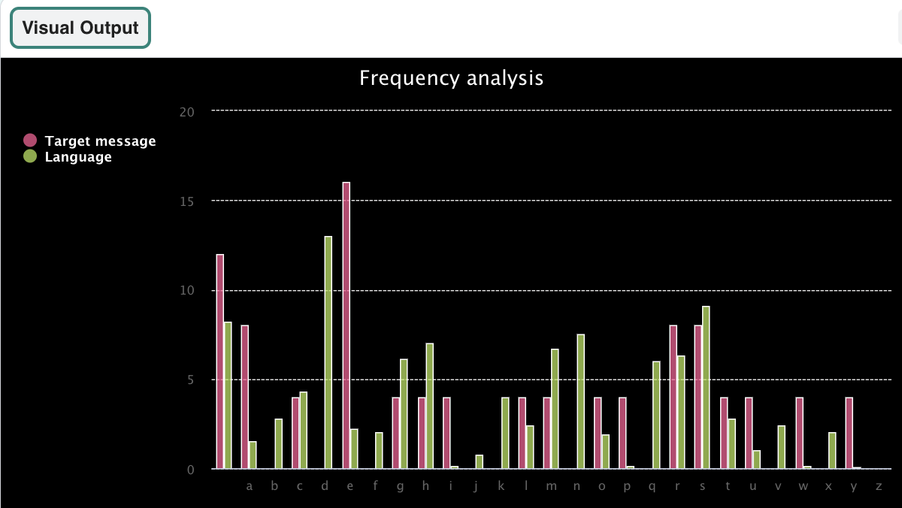

## Wat kun je verder nog doen?

Als je het [Meer Python](https://projects.raspberrypi.org/en/pathways/more-python) pad volgt, kun je doorgaan naar het [Codebreker](https://projects.raspberrypi.org/en/projects/codebreaker/) project. In dat project analyseer je een grafiek om een verborgen code te kraken!

--- print-only ---

--- /print-only ---

--- no-print ---

<iframe src="https://editor.raspberrypi.org/en/embed/viewer/codebreaker-project-example" width="600" height="600" frameborder="0" marginwidth="0" marginheight="0" allowfullscreen>
</iframe>

--- /no-print ---

Als je meer plezier wilt hebben met het verkennen van Python, dan kun je een van [deze projecten](https://projects.raspberrypi.org/en/projects?software%5B%5D=python) uitproberen.
